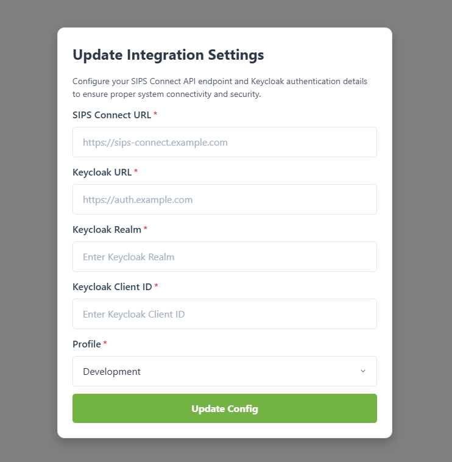
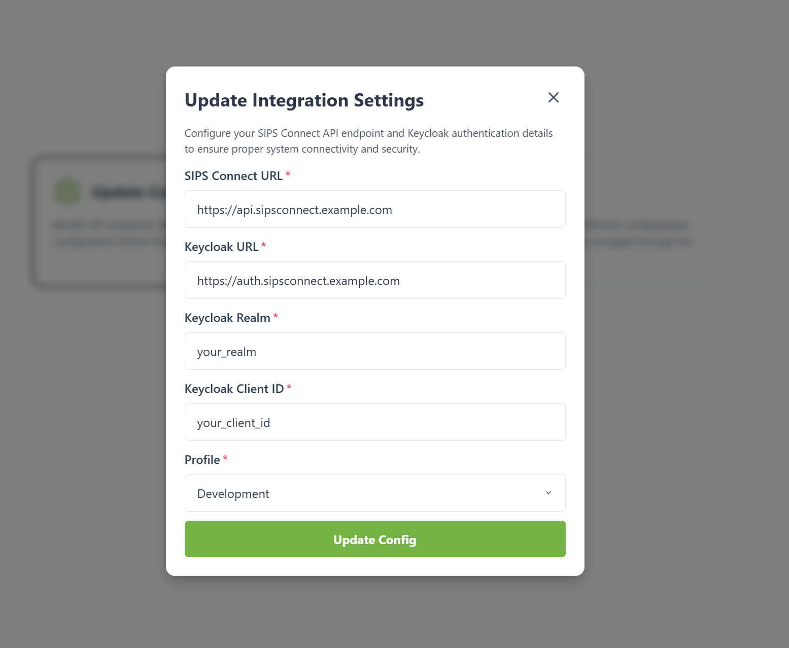
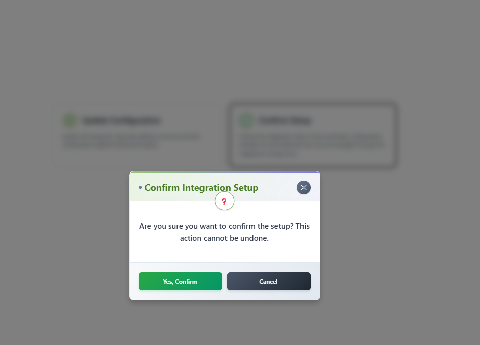
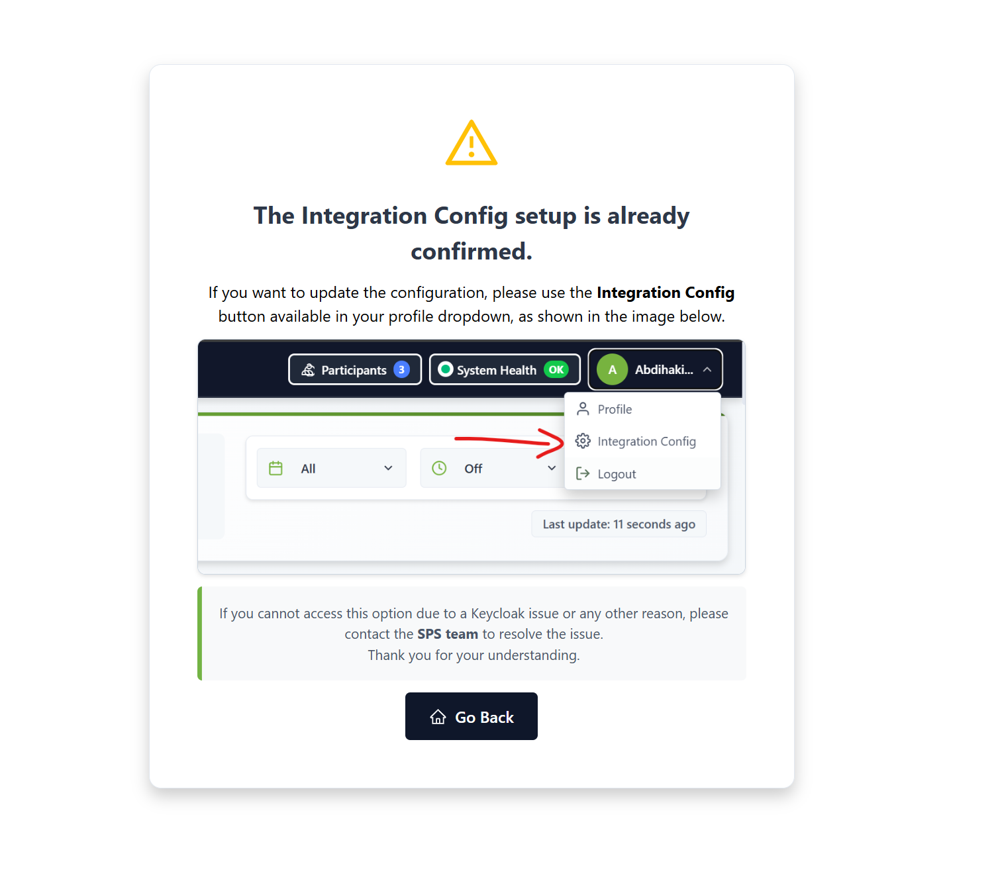

# SPS / SIPS Dashboard UI - Local Development Guide

This guide will help you set up and run the **SPS / SIPS Dashboard UI** locally, with HTTPS enabled using a self-signed SSL certificate, and runtime configuration through `db.json`.

---

## Table of Contents

1. [Prerequisites](#prerequisites)
2. [Directory Structure](#directory-structure)
3. [Generating a Self-Signed SSL Certificate](#generating-a-self-signed-ssl-certificate)
4. [Running the App](#running-the-app)

    * [Using Docker Compose](#using-docker-compose)
    * [Locally Without Docker](#locally-without-docker)
5. [Runtime Configuration (`db.json`)](#runtime-configuration-dbjson)
6. [What This Controls](#what-this-controls)
7. [First-Time Setup (UI Flow)](#first-time-setup-ui-flow)
8. [Profile-Based Feature Visibility](#profile-based-feature-visibility)
9. [Why This Dashboard?](#why-this-dashboard)

---

## Prerequisites

* **Node.js** v18+
* **npm** (comes with Node.js)
* **Docker & Docker Compose** (optional)
* **OpenSSL** (for generating self-signed certificates)

---

## Directory Structure

```
sps-dashboard-ui/
├── certs/
│   ├── tls.crt         # SSL certificate (generated locally)
│   └── tls.key         # SSL private key (generated locally)
├── components/         # React components
├── pages/              # Next.js pages
├── public/             # Static assets
├── server-https.js     # HTTPS server entrypoint
├── entrypoint-https.sh # Docker HTTPS startup script
├── Dockerfile
├── docker-compose.yml
├── package.json
├── db.json             # Default runtime configuration
├── .gitignore
└── ...
```

---

## Generating a Self-Signed SSL Certificate

Inside your project root:

```bash
mkdir -p certs
cd certs

# 1. Generate a private key
openssl genrsa -out tls.key 2048

# 2. Generate a self-signed certificate (replace 127.0.0.1 with local IP if needed)
openssl req -new -x509 -key tls.key -out tls.crt -days 365 -subj "/CN=127.0.0.1"
```

This generates `tls.key` and `tls.crt` in the `certs/` folder.

---

## Running the App

### Using Docker Compose

1. Ensure the Docker network exists:

```bash
docker network create --driver bridge sips-network
```

2. Build and start the app:

```bash
docker-compose up --build
```

3. Open your browser at: [https://localhost:3000](https://localhost:3000)
   Accept the self-signed certificate warning.

---

### Locally Without Docker

1. Install dependencies:

```bash
npm install
```

2. Ensure `certs/tls.crt` and `certs/tls.key` exist.
3. Build and run the server:

```bash
npm run build
node server-https.js
```

4. Visit [https://localhost:3000](https://localhost:3000)

---

## Runtime Configuration (`db.json`)

The application now **uses `db.json` for runtime configuration**, replacing the old `.env` approach.

### Default `db.json`

```json
{
  "config": {
    "api": {
      "baseUrl": ""
    },
    "keycloak": {
      "url": "",
      "realm": "",
      "clientId": ""
    },
    "profile": "dev",
    "uiGuards": {
      "forceFormCompletion": true,
      "setupConfirmed": false
    }
  }
}
```

---

## What This Controls

The `db.json` configuration controls:

* **API base URL** → The backend endpoints the UI interacts with.
* **Keycloak authentication** → URL, realm, and client ID.
* **Active profile** → `dev`, `test`, or `prod`. Determines which features are visible.
* **UI behavior guards** → e.g., forcing setup completion before accessing the dashboard.

**All values can be updated directly from the UI** after startup. Changes are persisted to `db.json` automatically.

---

## First-Time Setup (UI Flow)

When the portal starts for the first time:

1. **Default configuration is loaded** from `db.json`.
2. **Setup screen is displayed** to the user.
3. **User enters API & Keycloak details** via the configuration UI.
4. **Configuration is saved to disk** in `db.json`.
5. **Portal becomes fully operational**, and all pages are accessible according to the profile and UI guards.

### Example Screenshots
* Setup Screen:
  

> **Note:** If you cannot access the dashboard due to incorrect configuration, you can visit the **Setup Configuration page** (`/setup-config`) to update your settings.  
> After confirming the setup, the page will no longer be editable. If accessed afterwards, it will display an informational message indicating that the integration setup is already confirmed.

### `/setup-config` Screenshots

* **Update Configuration Modal (if values need correction):**  
  


* **Confirm Setup Modal:**  
  

* **Post-Confirmation `/setup-config` Message:**  
  
---
## Profile-Based Feature Visibility

Certain pages, like API testers, are **hidden in `prod`** to prevent misuse.
The `profile` in `db.json` controls this:

| Profile | Feature Visibility      |
| ------- | ----------------------- |
| dev     | All features visible    |
| test    | Some tools hidden       |
| prod    | Admin/test pages hidden |

---

## Why This Dashboard?

This dashboard was created to provide a **convenient and efficient way to interact with the SIPS Connect platform**. It allows users to:

* **Manage platform features** through a centralized UI.
* **Monitor system activity** and logs easily.
* **Perform administrative tasks** efficiently.
* **Configure runtime settings** dynamically via `db.json`.

It is designed for **both development and production environments**, with profile-based feature visibility to ensure safe operation.