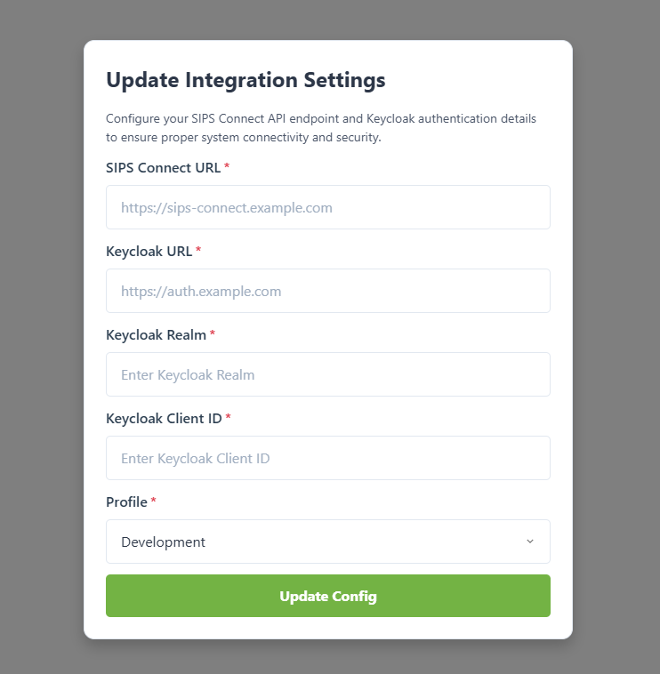
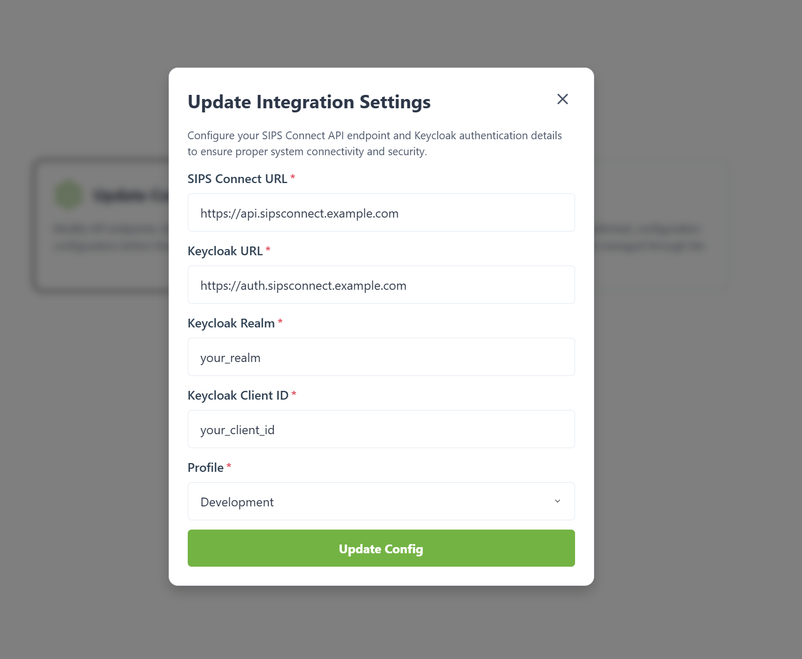
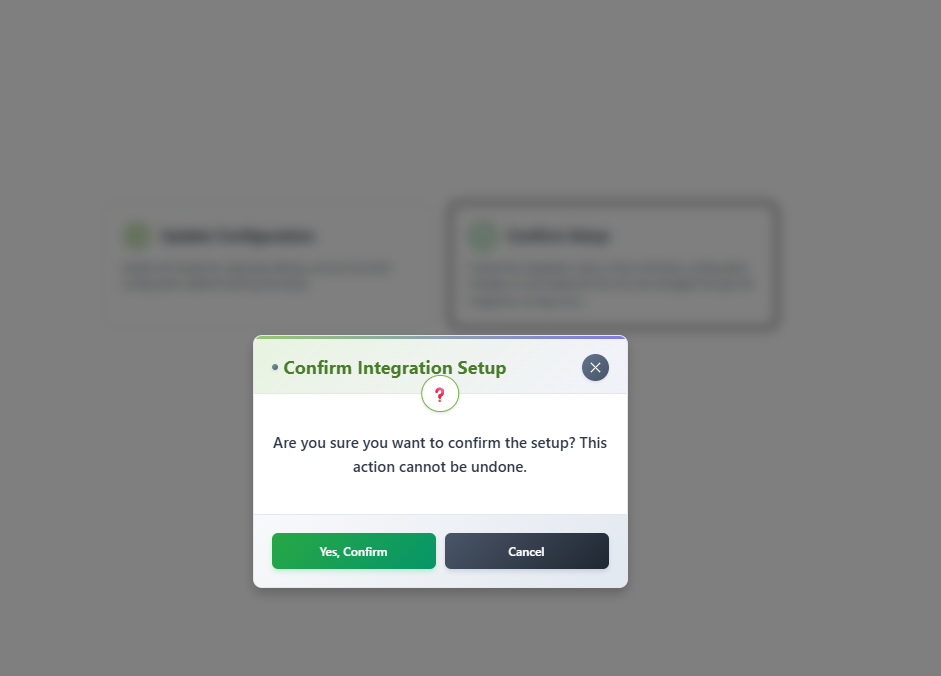
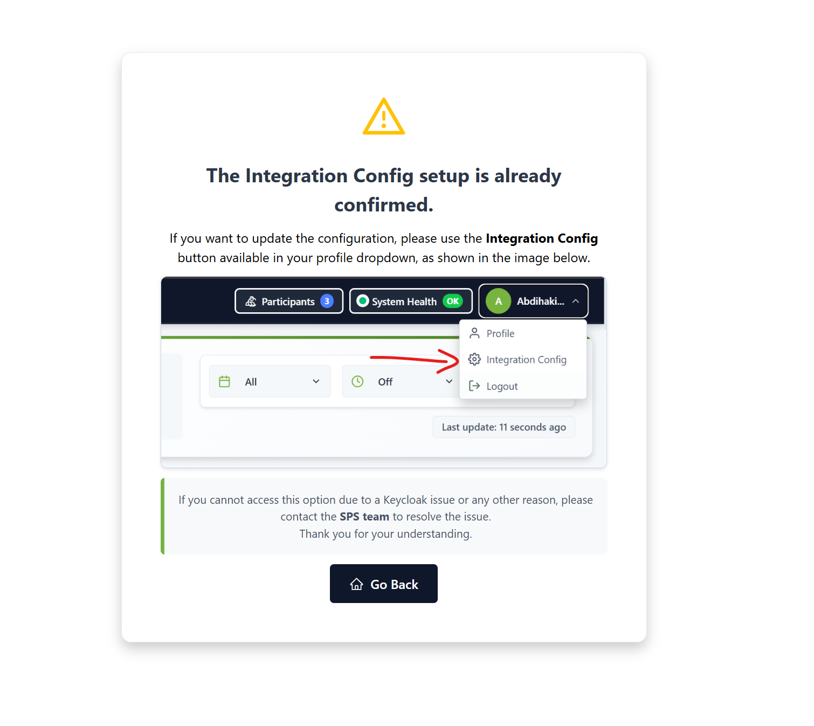

# SPS / SIPS Dashboard UI (SIPS Connect Portal)

The **SPS / SIPS Dashboard UI** (Docker image: [`abdoulhakim/sips-connect-portal`](https://hub.docker.com/r/abdoulhakim/sips-connect-portal)) is the official web management portal for the **Somali Instant Payment System (SIPS) Connect** ecosystem, developed and maintained by **SOMALI PAYMENT SWITCH (SPS) LTD**.

It enables financial institutions, participants, and system administrators to manage platform integrations, configure runtime settings via `db.json`, monitor ISO 20022 message streams, and manage PKI / Data Protection Keys securely.

---

## Table of Contents

1. [Features](#features)
2. [Prerequisites](#prerequisites)
3. [Directory Structure](#directory-structure)
4. [Generating SSL Certificates](#generating-a-self-signed-ssl-certificate)
5. [Running the App](#running-the-app)
    - [Using Docker](#using-docker-compose)
    - [Locally Without Docker](#locally-without-docker)
6. [Runtime Configuration (`db.json`)](#runtime-configuration-dbjson)
7. [Profile-Based Feature Visibility](#profile-based-feature-visibility)
8. [First-Time Setup (UI Flow)](#first-time-setup-ui-flow)
9. [Contributing](#contributing)
10. [Security Policy](#security-policy)

---

## Features

- **Integration Management**: Centralized management portal for `sips-connect` backend services.
- **ISO 20022 Message Inspector**: Live transaction logs, raw XML viewers, and message status tracking.
- **Dynamic Configuration (`db.json`)**: Runtime API and Keycloak authentication settings configurable directly via UI.
- **PKI & Key Management**: Display and management of Certificate Authority (CA) chains and Data Protection keys.
- **Profile Guards**: Environmental profile feature filtering (`dev`, `test`, `prod`) to enforce production safety.

---

## Prerequisites

* **Node.js**: v18+
* **npm**: (included with Node.js)
* **Docker & Docker Compose**: (optional for containerized execution)
* **OpenSSL**: (for generating local SSL/TLS certificates)

---

## Directory Structure

```
sps-dashboard-ui/
├── certs/
│   ├── tls.crt         # SSL certificate (generated locally, gitignored)
│   └── tls.key         # SSL private key (generated locally, gitignored)
├── component/          # React layout and UI components
├── pages/              # Next.js pages and documentation routes
├── public/             # Static assets
├── server-https.js     # Custom HTTPS server entrypoint
├── entrypoint-https.sh # Docker HTTPS startup script
├── Dockerfile          # Docker image build specification
├── docker-compose.yml  # Local multi-container compose file
├── package.json        # Project dependencies and npm scripts
├── db.json             # Runtime configuration file (gitignored)
├── CONTRIBUTING.md     # Development & contribution guidelines
├── SECURITY.md         # Vulnerability reporting & security policy
└── README.md
```

---

## Generating a Self-Signed SSL Certificate

Inside the project root:

```bash
mkdir -p certs
cd certs

# 1. Generate private key
openssl genrsa -out tls.key 2048

# 2. Generate self-signed certificate (replace 127.0.0.1 with local IP if needed)
openssl req -new -x509 -key tls.key -out tls.crt -days 365 -subj "/CN=127.0.0.1"
```

This generates `tls.key` and `tls.crt` inside `certs/` (which are excluded from git via `.gitignore`).

---

## Running the App

### Using Docker Hub Image

```bash
docker pull abdoulhakim/sips-connect-portal:latest
```

### Using Docker Compose Locally

1. Create the Docker bridge network:
   ```bash
   docker network create --driver bridge sips-network
   ```

2. Build and run:
   ```bash
   docker-compose up --build
   ```

3. Open [https://localhost:3000](https://localhost:3000) in your browser.

---

### Running Locally Without Docker

1. Install dependencies:
   ```bash
   npm install
   ```

2. Ensure `certs/tls.crt` and `certs/tls.key` exist.
3. Build and run the server:
   ```bash
   npm run build
   node server-https.js
   ```

4. Visit [https://localhost:3000](https://localhost:3000).

---

## Runtime Configuration (`db.json`)

Runtime configuration is stored in `db.json` and loaded dynamically by the application:

```json
{
  "config": {
    "api": {
      "baseUrl": ""
    },
    "keycloak": {
      "url": "",
      "realm": "",
      "clientId": ""
    },
    "profile": "dev",
    "uiGuards": {
      "forceFormCompletion": true,
      "setupConfirmed": false
    }
  }
}
```

Configuration values can be updated directly from the UI via `/setup-config`.

---

## Profile-Based Feature Visibility

Feature visibility is dynamically controlled based on the active `profile` set in `db.json`:

| Profile | Feature Visibility |
| ------- | ------------------ |
| `dev`   | All features, debug screens, and testing tools visible |
| `test`  | Testing tools visible; administrative options restricted |
| `prod`  | API test tools, raw message builders, and debug pages hidden |

---

## First-Time Setup (UI Flow)

When starting the application for the first time:

1. Default settings load from `db.json`.
2. The user is presented with the setup screen at `/setup-config`.
3. The user inputs API and Keycloak connection details.
4. Settings are saved to `db.json`.
5. Dashboard features activate based on the configured profile.

### Setup Screenshots

* **Initial Setup Screen:**
  

* **Update Configuration Modal:**
  

* **Confirm Setup Modal:**
  

* **Confirmed Setup View:**
  

---

## Contributing

Please review [CONTRIBUTING.md](CONTRIBUTING.md) before submitting pull requests or contributing code to this repository. All contributions are covered under the Apache License 2.0.

---

## Security Policy

Security vulnerabilities should be reported privately to **SOMALI PAYMENT SWITCH (SPS) LTD** according to the procedures outlined in [SECURITY.md](SECURITY.md). Please do not open public GitHub issues for security vulnerabilities.